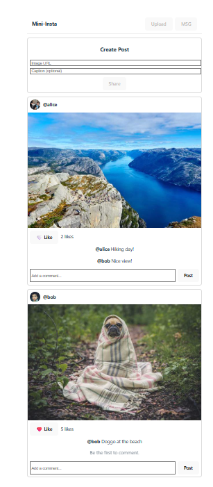
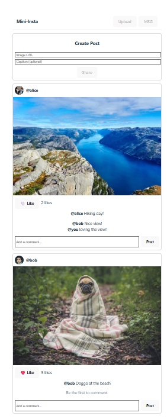
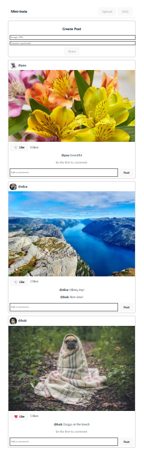
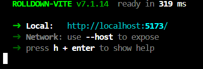

Name: Brehana Naidu
Course: CSCI 4360 — Web Technologies
Lab: Lab 2 — React Tutorial: Building SLU-stagram
Due: October 14, 2025

A React 18 + Vite app that functions as a mini Instagram styled feed with posts, likes, comments, and the ability to compose new posts.

I've stored the main posts state in App.jsx and it is passed down to child components. Feed maps through posts, PostCard renders each post, and Commenting or Composer update the state through setPosts.

**Feed View**

**Comment Added**

**Composer**

**Console (No Errors)**

